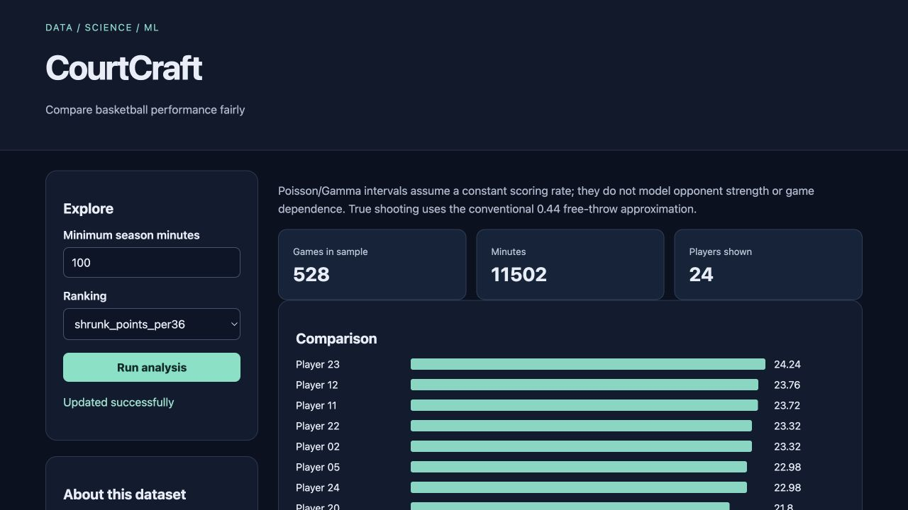

# CourtCraft

Compare basketball performance fairly for **sports analysts**.

Original topic: **Sports Analytics Deep Dive** from [the source post](https://www.instagram.com/p/DdyMaogE4ud/).

> Local portfolio implementation developed with Codex assistance. Measured results and limitations are documented; no production adoption, revenue or hiring outcome is claimed.



## What works

- Possession normalization
- shrinkage
- uncertainty
- player comparisons

[Example output](reports/example-output.json) · [Recorded checks](reports/test-results.txt) · [Learning and interview guide](LEARNING_GUIDE.md)

## Start

Python 3.12 is the validated Python runtime. Run commands from this repository directory. Windows users activate `.venv\Scripts\activate` instead of `source`.

```sh
python3.12 -m venv .venv
source .venv/bin/activate
python -m pip install -r requirements.txt
python generate.py
python app.py
```

Open **http://127.0.0.1:8080**. Keep the process running. Set `PORT` to use another port. The Python development servers are intended for local demonstrations.

## Demonstration

Compare raw points per 36 with shrunk points per 36. Increase minimum minutes and inspect how the rankings and intervals change. Export the complete result as JSON.

## Architecture and decisions

Browser controls → validated Flask API → project analysis/workflow → results and export.

Stack: pandas · scipy · Flask.

1. Normalize scoring per 36 minutes instead of ranking raw totals alone.
2. A Gamma-Poisson model shrinks small samples toward the global scoring rate.
3. Keep the prior exposure and uncertainty assumptions visible beside player rankings.

## Verification

```sh
python -m pytest -q
```

See [VERIFICATION.md](VERIFICATION.md) for actual executed checks, setup verification, model/data results and any outstanding environment limitations. The [recorded CI runs](reports/ci-verification.json) passed for the linked source revision.

## Data and attribution

Authored synthetic box scores. See [DATA_AND_SOURCES.md](DATA_AND_SOURCES.md) for provenance and usage notes. Original project code is MIT unless a preserved source file or dependency states otherwise. Model and third-party data licenses remain separate.

## Limitations and next improvement

Synthetic players and box scores. Constant-rate Poisson assumptions ignore pace, opponent quality, teammate effects and within-game dependence. True shooting uses the conventional approximate 0.44 free-throw coefficient.

Suggested extension: Add per-game bootstrapped uncertainty and compare it with the Gamma-Poisson intervals.

## Honest portfolio use

This implementation and documentation were developed with substantial Codex assistance. Before presenting it, run the demonstration, explain the design choices, and complete the suggested independent modification. Do not describe generated code as work experience, an accepted upstream contribution, or a deployed production service.
